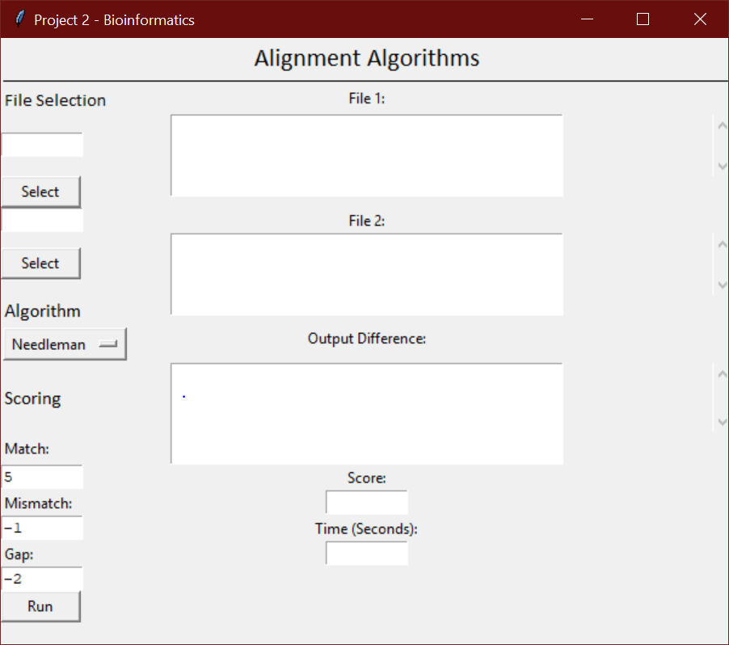
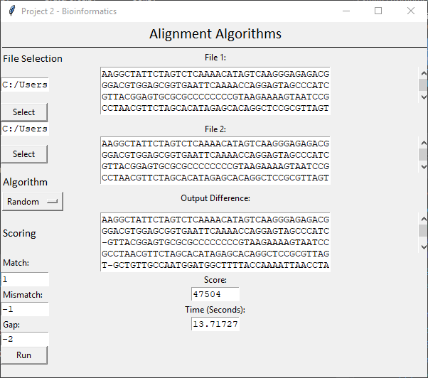

# How-To Run our Needleman-Wunsch Algorithm Program

### Note: NumPy library must be installed to run Needleman-Wunsch

1.	Download our folder
2.	Run the GUI.py file
 

 
3.	Select two files containing DNA sequences using the GUI’s file selector.
4.	Select which algorithm you want to score the sequences.
5.	Press “Run” and view the resulting output!

[Head back to the Main Page](https://jsebcort.github.io/NeedlemanWunsch/)
