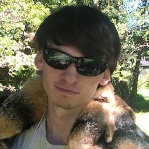

## Learn about our group members and their project roles

## **Group Members & Their Roles**

### Project Manager – Christopher Brown 

Animal body part they would want: Bat ears

### Researcher – Andrew March

Animal body part they would want: Elephant trunk

### Quality Assurance Specialist – Jennifer Mince 

Animal body part they would want: Eagle wings

Responsibilities:
1. Testing the program.
2. Ensures program runs smoothly, without errors, and with appropriate error messages.

### Developer – Edmund Sherman

Animal body part they would want: Octopus tentacles

### Technical Writer – Sebastian Cortes

Animal body part they would want: Crab claws

Responsibilities:
1. Create README files for both the GUI and algorithm code
2. Create a project page through GitHub Pages, with required sections.
3. Create a visually appealing and informational presentation.

### GUI Developer – Whitney Trovinger

Animal body part they would want: Fish tail

[Head back to the Main Page](https://jsebcort.github.io/NeedlemanWunsch/)
