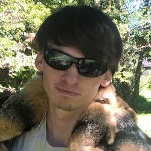

## Learn about our group members and their project roles

## **Group Members & Their Roles**

### Project Manager – Christopher Brown 

Animal body part they would want: Bat ears

Responsibilities:
1. Manage group time through meetings and deadlines.
2. Ensure milestones are met.
3. Aid other group members, if needed.

### Researcher – Andrew March

Animal body part they would want: Elephant trunk

Responsibilities:
1. Research the algorithm.
2. Produce a write-up of the history of the Needleman-Wunsch Algorithm
3. Produce a description of why the Needleman-Wunsch Algorithm is contemporary.
4. Construct a file format alongside the GUI developer.
5. Create a bibliography.

### Quality Assurance Specialist – Jennifer Mince 

Animal body part they would want: Eagle wings

Responsibilities:
1. Testing the program.
2. Ensures program runs smoothly, without errors, and with appropriate error messages.

### Developer – Edmund Sherman

Animal body part they would want: Octopus tentacles

Responsibilities:
1. Construct four different ways of implementing the Needleman-Wunsch algorithm:
    - Brute Force Algorithm
    - Dynamic Algorithm
    - Random Algorithm
    - Greedy/Divide & Conquer Algorithm
    
# REMEMBER TO FIX THE ABOVE, EITHER GREEDY OR D&C ONLY

### Technical Writer – Sebastian Cortes

Animal body part they would want: Crab claws

Responsibilities:
1. Create README files for both the GUI and algorithm code
2. Create a project page through GitHub Pages, with required sections.
3. Create a visually appealing and informational presentation.

### GUI Developer – Whitney Trovinger

Animal body part they would want: Fish tail

Responsibilities:
1. Create a GUI with the following features:
    - File select
    - Algorithm selection
    - Result display window
    - Write file with results
2. Develop a method of parsing files to a desired format.

[Head back to the Main Page](https://jsebcort.github.io/NeedlemanWunsch/)
