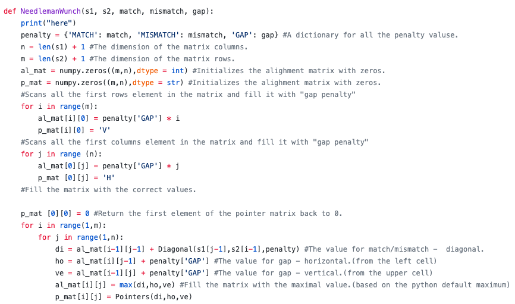
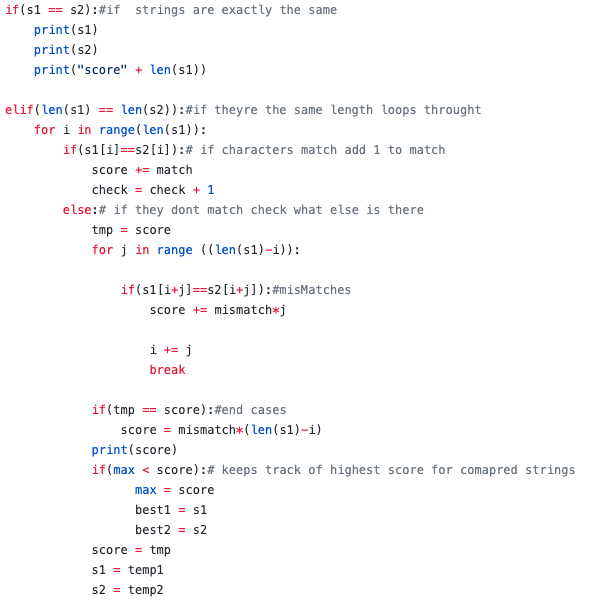

# Technical Information

Here you will discover a description of each of our implementations, as well as, snippets of code.

## Additional Information
Scoring - Based on the user input, integers are added together depending on if the two compared letters are matching, mismatching, and gaps.

## Algorithm Information

- Needleman-Wunsch - The algorithm creates two matrices. One is a scoring matrix that stores all the scores of two characters being compared. The other is the traceback matrix, which holds all of the the letters in the same position as they're scores. The traceback works by starting at the bottom-right position. It traverses going to the highest score from its current position. Usually the movement is diagonally or upward, and it ends up in the top-left position. Using the path created in the traceback matrix, it follows this path in the scoring matrix. If the movement is diagonal, it prints out the next letter. If its upward or to the side, it inserts a "-". At the end, the aligned string is printed, alongside the final score.

- Random - Randomly picks between a series of possible priorities of either gaps or mismatches. Scoring regarding matching letters stays the same.

- Greedy - As the strings are parsed, if a match occurs, the scoring is the same as normal. If a mismatch occurs, it will find the quickest solution to solving the issue. When looking for a gap or mismatch, it simply chooses the one that will take the least amount of time to resolve.

- Brute-Force - When parsing through the strings, if a gap or mismatch occurs, every possible permutation is checked. Once every possible permutation is calculated, it chooses the lowest score. This continues until both strings are finished being compared.

[Head back to the Main Page](https://jsebcort.github.io/NeedlemanWunsch/)
